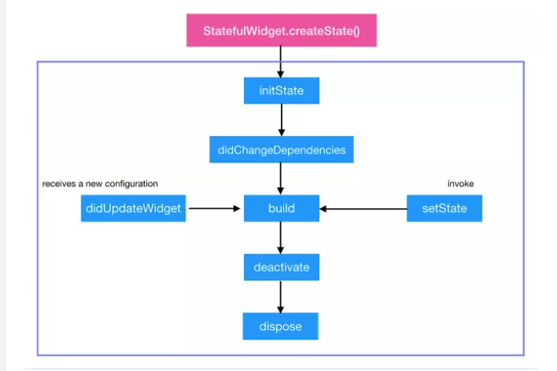

# StatelessWidget

> 一个 StatelessWidget 是不能被改变的，比如：Icon、Text 等。如果你的控件一旦显示，就不需要再做任何的变更，那么你应该使用 StatelessWidget。

```dart
// 实现
class MyWidget extends StatelessWidget {
  @override
  Widget build(BuildContext context){
    // build 返回视图
    return _buildMyWidget(context);
  }
}
```

# StatefulWidget

> 一个 StatefulWidget 是有状态的，可变的。 它可以改变自己的外观，以响应用户的操作或者数据的变化。 比如：CheckBox、Switch.. 我们之所以能够改变一个 StatefulWidget，是因为它有一个设置状态的函数：

```dart
setState((){
  // 更新状态数据
})
```

## 自定义 StatefulWidget

1. 实现一个 StatefulWidget

```dart
class FavoriteStatefulWidget extends StatefulWidget {
  @override
  State<StatefulWidget> createState() => _FavoritesStatefulWidgetState();
}
```

2. 实现一个 State

```dart
Class _FavoriteStatefulWidget extends State<FavoriteStatefulWidget> {
  bool _isFavorited = true;
  int _favoriteCount = 41;

  void _toggleFavorite (){
    setState((){
      if(_isFavorited){
        _favoriteCount -= 1;
        _isFavorited = false;
      }else {
        _favoriteCount += 1;
        _isFavorited = true
      };
    })
  }

  @override
  Widget build(buildContext context) => Row(
    mainAxisSize: MainAxisSize.min,
    children: [
      Container(
        padding:EdgeInsets.all(0),
        child:IconButton(
          icon: (_isFavorited ? Icon(Icons.star) : Icon(Icons.star_border)),
          color:colors.red[500],
          onPressed:_toogleFavorite
        ),
      ),
      SizeBox(
        width:18,
        child:Container(
          child:Text('$_favoriteCount')
        )
      )
    ]
  )
}


mian() => runApp(MaterialApp(
  title: 'Flutter Demo',
  home:Scaffold(
    appBar:AppBar(
      title:Text('Flutter Demo'),
    ),
    body:Container(
      color: Colors.white,
      child: Center(
        child: FavoriteStatefulWidget(),
      ),
    ),
  ),
))
```

## 生命周期

### image



### detial

1. StatefulWidget.createState()
  Framework 调用会通过调用StatefulWidget.createState()创建一个State
2. initState()
  新创建的State 会和一个BuildContext产生关联，此时认为State已经安装好了，initState() 函数将会被调用

3. didChangeDependcies()
  在initState() 调用结束后，这个函数会被调用。事实上，当State对象依赖发生变化时，这个函数总是会被Framework调用

4. build()
  经过以上步骤，系统认为一个State已经准备好了，就会调用build() 来构建视图，我们需要在这个函数中，返回一个Widget

5. deactivate()
  当State被暂时从视图中移除时，会调用这个函数。页面切换时，会调用它，因为此时State在视图树中的位置发生了变化，需要先暂时移除后添加
  * 注意，重写时候必须调用super。deactive()
6. dispose()
  当State被永久的从视图树中移除，FrameWork会调用该函数
  在销毁前触发，我们可以在这里进行最终的资源释放。
  在调用这个函数之前，总会先调用 deactivate()。
  ⚠️注意，重写的时候必须要调用 super.dispose()。

7. didUpdateWidget(covariant T oldWidget)
  当widget的配置发生变化时，会调用这个函数。
  比如，Hot-reload的时候会调用这个函数。
  这个函数调用后，会调用build

8. setState()
  当我们需要更新视图时候我们，需要手动调用这个函数。


